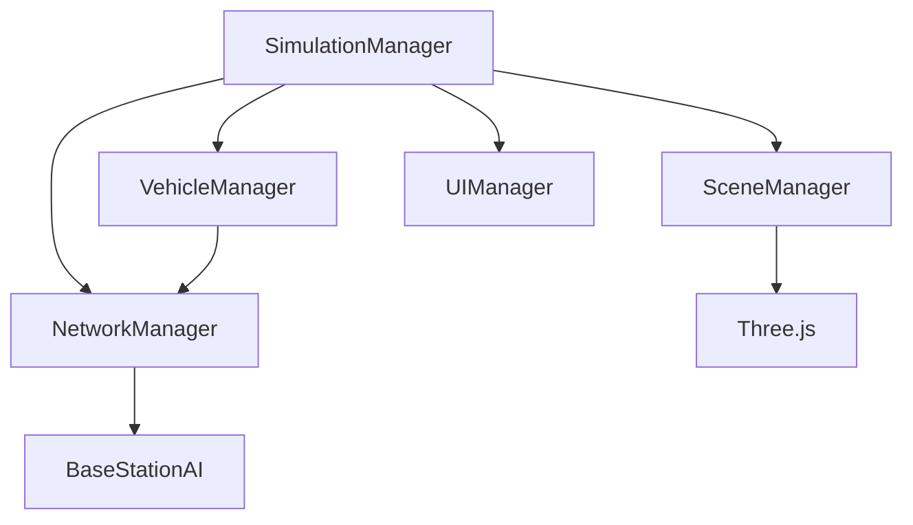

# Vehicle Network Simulation - Architecture Documentation

## 1. System Overview

### 1.1 Purpose
The Vehicle Network Simulation demonstrates a sophisticated vehicle-to-vehicle (V2V) and vehicle-to-infrastructure (V2I) communication system using modern web technologies. It visualizes real-time network interactions between vehicles using different communication protocols (DSRC, WiFi, LTE) with AI-based network selection.

### 1.2 Technology Stack
- **Frontend**: HTML5, CSS3, JavaScript (ES6+)
- **3D Visualization**: Three.js
- **AI/ML**: Custom reinforcement learning implementation
- **Build Tools**: Native ES6 modules

## 2. System Architecture

### 2.1 Directory Structure
```
advanced/
├── index_advanced.html      # Main application entry
├── css/
│   └── styles.css          # UI styling
├── js/
│   ├── main.js            # Application entry point
│   ├── SimulationManager.js # Core simulation logic
│   ├── ai/                # AI components
│   │   └── BaseStationAI.js
│   ├── visuals/           # 3D visualization
│   │   └── SceneManager.js
│   ├── ui/                # User interface
│   │   └── UIManager.js
│   ├── network/           # Network simulation
│   │   └── NetworkManager.js
│   ├── vehicles/          # Vehicle management
│   │   └── VehicleManager.js
│   └── config/            # Configuration
│       └── config.js
└── assets/                # Static resources
    └── Landscape_2.jpeg
```

### 2.2 Component Interaction


## 3. Core Components

### 3.1 SimulationManager
The central orchestrator that coordinates all simulation components.

```javascript
export class SimulationManager {
    constructor() {
        this.isRunning = false;
        this.clock = new THREE.Clock();
    }

    async initializeManagers() {
        // Initialize scene, vehicles, network, and UI
        this.sceneManager = new SceneManager();
        this.vehicleManager = new VehicleManager(this.scene);
        this.networkManager = new NetworkManager(this.scene, this.vehicleManager);
        this.uiManager = new UIManager();
    }
}
```

### 3.2 NetworkManager
Handles all network-related operations and communication protocols.

```javascript
class NetworkManager {
    constructor() {
        this.networks = {
            DSRC: { range: 100, latency: 50 },
            WIFI: { range: 50, latency: 100 },
            LTE: { range: 1000, latency: 150 }
        };
    }

    update(deltaTime, currentTime) {
        // Update network states
        // Handle packet transmission
        // Manage handovers
    }
}
```

### 3.3 VehicleManager
Manages vehicle creation, movement, and interactions.

```javascript
class VehicleManager {
    constructor() {
        this.vehicles = [];
        this.vehicleTypes = {
            CAR: { speed: 0.2, size: 1 },
            TRUCK: { speed: 0.15, size: 1.5 },
            BUS: { speed: 0.1, size: 2 }
        };
    }

    updatePositions(deltaTime, currentTime) {
        // Update vehicle positions
        // Handle collisions
        // Manage vehicle communication
    }
}
```

## 4. AI Implementation

### 4.1 BaseStationAI
Implements reinforcement learning for network selection.

```javascript
class BaseStationAI {
    constructor() {
        this.epsilon = 1.0;  // Exploration rate
        this.learningRate = 0.1;
        this.discountFactor = 0.9;
    }

    selectNetwork(state) {
        // Epsilon-greedy policy
        if (Math.random() < this.epsilon) {
            return this.explore();
        }
        return this.exploit(state);
    }
}
```

## 5. Visualization System

### 5.1 SceneManager
Handles all Three.js related operations and 3D rendering.

```javascript
class SceneManager {
    constructor() {
        this.scene = new THREE.Scene();
        this.camera = new THREE.PerspectiveCamera(75, window.innerWidth / window.innerHeight, 0.1, 1000);
        this.renderer = new THREE.WebGLRenderer({ antialias: true });
    }

    initialize() {
        // Setup scene
        // Add lighting
        // Create road and environment
    }
}
```

## 6. User Interface

### 6.1 UIManager
Manages all UI elements and updates.

```javascript
class UIManager {
    constructor() {
        this.stats = {
            packetsSent: 0,
            packetsReceived: 0,
            packetsLost: 0,
            fps: 0
        };
    }

    updateStats(stats) {
        // Update UI elements with new statistics
    }
}
```

## 7. Performance Metrics

### 7.1 Key Metrics
- Frames Per Second (FPS)
- Packet Statistics
  - Sent/Received/Lost
  - Network-specific stats
- Network Performance
  - Latency
  - Packet loss rate
- AI Learning Progress
  - Exploration rate
  - Success rate

### 7.2 Monitoring
```javascript
updateStats() {
    const stats = {
        packetsSent: this.networkManager.stats.packetsSent,
        packetsReceived: this.networkManager.stats.packetsReceived,
        packetsLost: this.networkManager.stats.packetsLost,
        fps: 1 / this.clock.getDelta(),
        averageLatency: this.networkManager.stats.totalLatency / 
                       (this.networkManager.stats.packetsReceived || 1)
    };
}
```

## 8. Future Enhancements

### 8.1 Planned Features
1. **Enhanced AI**
   - Deep reinforcement learning
   - Multi-agent coordination
   - Predictive handover

2. **Network Improvements**
   - 5G integration
   - Edge computing support
   - Quality of Service (QoS) metrics

3. **Visualization**
   - Weather effects
   - Day/night cycle
   - Traffic patterns

4. **Vehicle Features**
   - More vehicle types
   - Advanced collision detection
   - Dynamic speed adjustment

## 9. Development Guidelines

### 9.1 Code Style
- ES6+ features
- Modular architecture
- Clear component separation
- Comprehensive documentation

### 9.2 Best Practices
- Performance optimization
- Memory management
- Error handling
- Testing procedures 