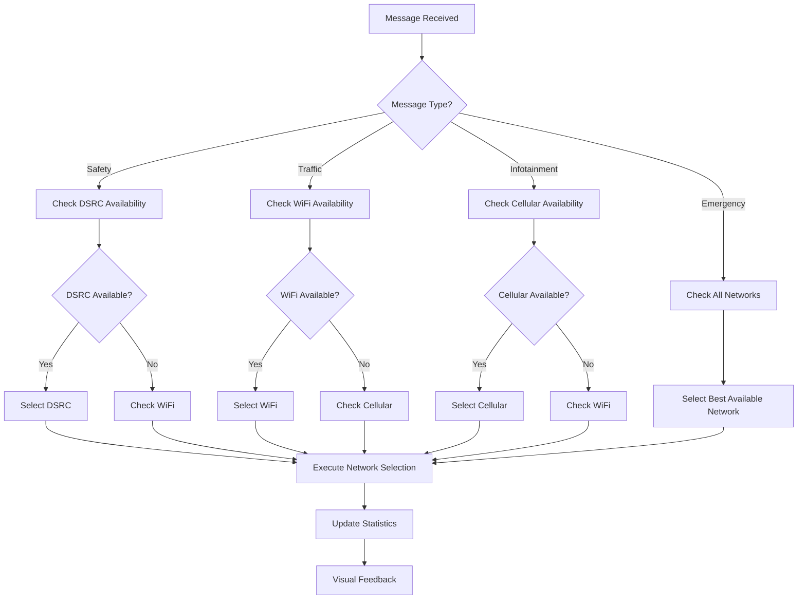
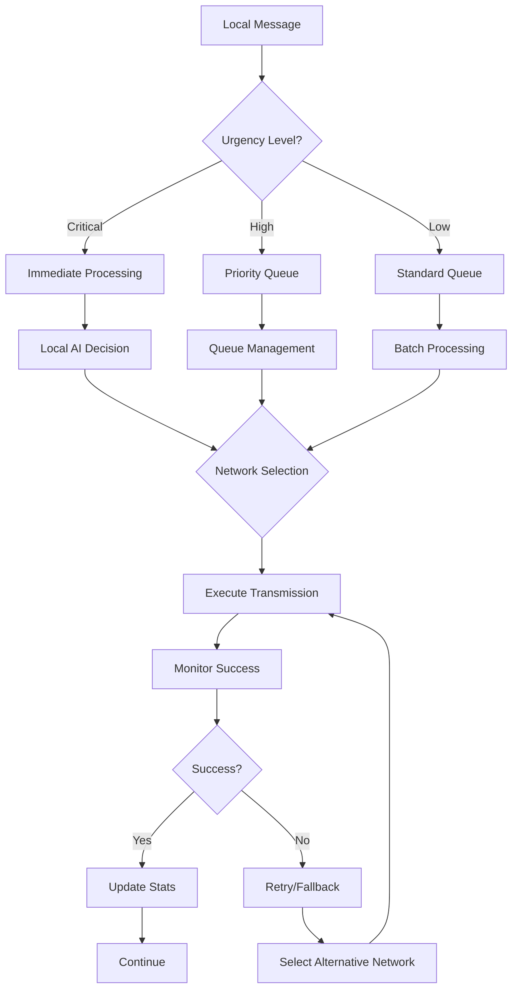
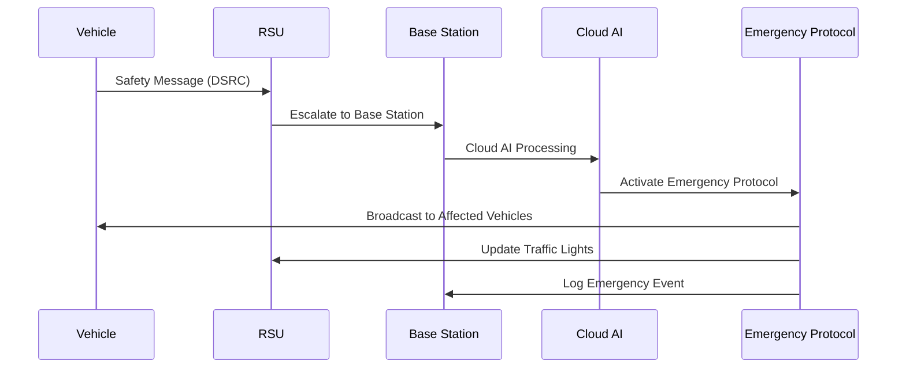
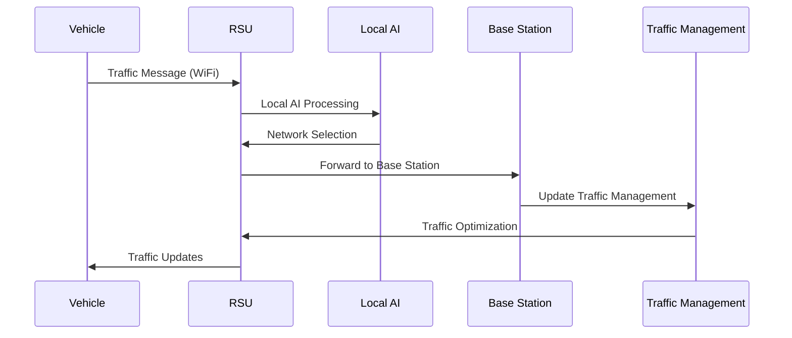
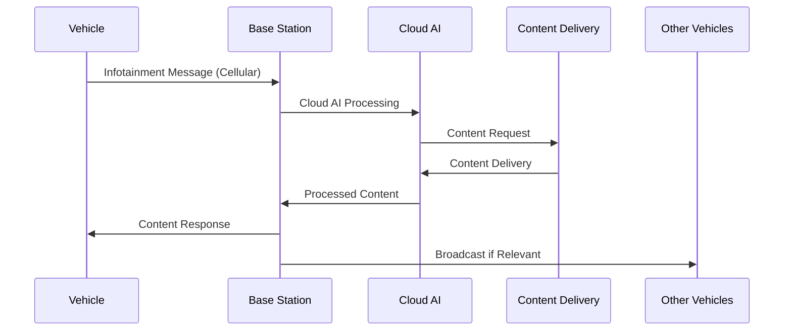
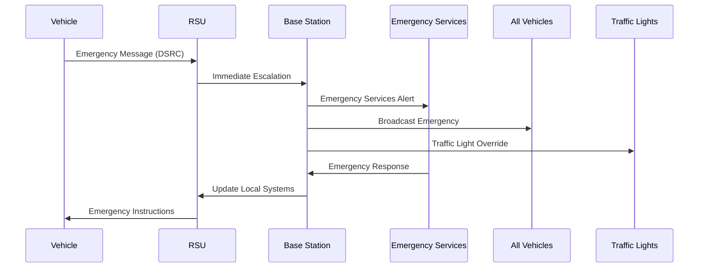
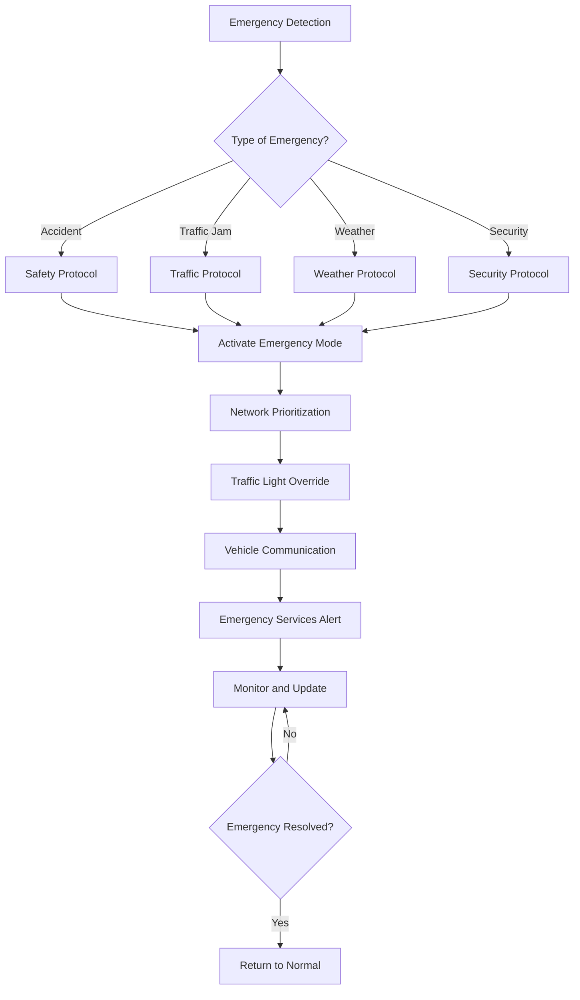

# Message Types and Network Communication Flow Documentation

## Overview
This document provides a comprehensive guide to the V2X message types, network communication priorities, and decision-making flows implemented in the enhanced simulation system.

## 🔄 Complete Processing Flow Diagram

```
┌─────────────────────────────────────────────────────────────────┐
│                    VEHICLE MESSAGE GENERATION                   │
└─────────────────────────────────────────────────────────────────┘
                                │
                                ▼
┌─────────────────────────────────────────────────────────────────┐
│                    MESSAGE TYPE DETERMINATION                   │
│                                                                 │
│  🚨 SAFETY_MESSAGE (60% if emergency)                          │
│  🟢 BASIC_CAM_MESSAGE (60% probability)                        │
│  🟠 TRAFFIC_MESSAGE (20% probability)                          │
│  🔵 INFOTAINMENT_MESSAGE (20% probability)                     │
└─────────────────────────────────────────────────────────────────┘
                                │
                                ▼
┌─────────────────────────────────────────────────────────────────┐
│                    NETWORK SELECTION (AI)                      │
│                                                                 │
│  ☁️ Cloud AI Decision (confidence > 0.7)                       │
│  🤖 Local AI Fallback (confidence < 0.7)                       │
│                                                                 │
│  DSRC ← SAFETY_MESSAGE, BASIC_CAM_MESSAGE                      │
│  WIFI ← BASIC_CAM_MESSAGE, TRAFFIC_MESSAGE                     │
│  LTE ← TRAFFIC_MESSAGE, INFOTAINMENT_MESSAGE                   │
└─────────────────────────────────────────────────────────────────┘
                                │
                                ▼
┌─────────────────────────────────────────────────────────────────┐
│                    MESSAGE PROCESSING                           │
│                                                                 │
│  🚨 SAFETY_MESSAGE:                                            │
│    Vehicle → RSU → Base Station → Emergency Broadcast          │
│                                                                 │
│  🟢 BASIC_CAM_MESSAGE:                                         │
│    Vehicle → RSU → Nearby Vehicles (V2V fallback)              │
│                                                                 │
│  🟠 TRAFFIC_MESSAGE:                                           │
│    Vehicle → RSU → Base Station → Traffic System               │
│                                                                 │
│  🔵 INFOTAINMENT_MESSAGE:                                      │
│    Vehicle → Base Station → Content Delivery                   │
└─────────────────────────────────────────────────────────────────┘
                                │
                                ▼
┌─────────────────────────────────────────────────────────────────┐
│                    MONITORING & STATISTICS                      │
│                                                                 │
│  📊 Packet Success/Failure Tracking                            │
│  ⏱️ Latency Measurement                                        │
│  🚨 Emergency Protocol Tracking                                │
│  📡 Broadcast Success Monitoring                               │
└─────────────────────────────────────────────────────────────────┘
```

## Message Type Classification

### 1. Safety Messages (Priority: CRITICAL)
**Color Code**: 🔴 Red (0xff0000)
**Frequency**: High (every 100ms)
**Size**: Small (50-100 bytes)
**Network Preference**: DSRC → WiFi → Cellular

#### Characteristics
- **Urgency Level**: Immediate
- **Latency Requirement**: < 10ms
- **Reliability**: 99.9%
- **Scope**: Local to Regional

#### Content Examples
```javascript
{
    type: 'SAFETY_MESSAGE',
    priority: 'CRITICAL',
    urgency: 'IMMEDIATE',
    data: {
        emergency: true,
        critical: Math.random() < 0.3,
        warning: Math.random() < 0.5,
        hazard: Math.random() < 0.4,
        vehicleSpeed: vehicle.userData.speed,
        position: vehicle.position,
        timestamp: Date.now()
    }
}
```

#### Processing Flow
```
Vehicle → RSU → Base Station → Cloud AI → Emergency Protocol
   ↓         ↓         ↓           ↓           ↓
 50ms     100ms     200ms      500ms      1000ms
```

### 2. Traffic Messages (Priority: HIGH)
**Color Code**: 🟡 Yellow (0xffff00)
**Frequency**: Medium (every 500ms)
**Size**: Medium (200-500 bytes)
**Network Preference**: WiFi → DSRC → Cellular

#### Characteristics
- **Urgency Level**: High
- **Latency Requirement**: < 100ms
- **Reliability**: 95%
- **Scope**: Local to City

#### Content Examples
```javascript
{
    type: 'TRAFFIC_MESSAGE',
    priority: 'HIGH',
    urgency: 'HIGH',
    data: {
        trafficCondition: 'CONGESTION',
        averageSpeed: 25,
        queueLength: 15,
        incidentType: 'ACCIDENT',
        location: vehicle.position,
        timestamp: Date.now()
    }
}
```

#### Processing Flow
```
Vehicle → RSU → Local AI → Base Station → Traffic Management
   ↓         ↓         ↓           ↓           ↓
100ms     200ms     300ms      500ms      1000ms
```

### 3. Infotainment Messages (Priority: LOW)
**Color Code**: 🔵 Cyan (0x00ffff)
**Frequency**: Low (every 2000ms)
**Size**: Large (1-5 KB)
**Network Preference**: Cellular → WiFi

#### Characteristics
- **Urgency Level**: Low
- **Latency Requirement**: < 1000ms
- **Reliability**: 90%
- **Scope**: Regional to Global

#### Content Examples
```javascript
{
    type: 'INFOTAINMENT_MESSAGE',
    priority: 'LOW',
    urgency: 'LOW',
    data: {
        contentType: 'ENTERTAINMENT',
        mediaType: 'VIDEO',
        quality: 'HD',
        duration: 300,
        location: vehicle.position,
        timestamp: Date.now()
    }
}
```

#### Processing Flow
```
Vehicle → Base Station → Cloud AI → Content Delivery Network
   ↓           ↓           ↓           ↓
500ms       1000ms      1500ms      2000ms
```

### 4. Emergency Messages (Priority: CRITICAL)
**Color Code**: 🟣 Magenta (0xff00ff)
**Frequency**: Event-driven
**Size**: Variable (100-1000 bytes)
**Network Preference**: DSRC → WiFi → Cellular

#### Characteristics
- **Urgency Level**: Critical
- **Latency Requirement**: < 5ms
- **Reliability**: 99.99%
- **Scope**: Local to Global

#### Content Examples
```javascript
{
    type: 'EMERGENCY_MESSAGE',
    priority: 'CRITICAL',
    urgency: 'CRITICAL',
    data: {
        emergencyType: 'ACCIDENT',
        severity: 'HIGH',
        location: vehicle.position,
        affectedVehicles: 5,
        requiredResponse: 'IMMEDIATE',
        timestamp: Date.now()
    }
}
```

#### Processing Flow
```
Vehicle → RSU → Base Station → Emergency Services → All Vehicles
   ↓         ↓         ↓           ↓           ↓
 10ms      20ms      50ms       100ms       200ms
```

## Network Selection Priority Matrix

### Decision Factors
1. **Message Priority** (40% weight)
2. **Network Availability** (30% weight)
3. **Current Load** (20% weight)
4. **Cost** (10% weight)

### Priority Matrix Table

| Message Type | DSRC | WiFi | Cellular | Satellite |
|-------------|------|------|----------|-----------|
| Safety      | 1st  | 2nd  | 3rd      | 4th       |
| Emergency   | 1st  | 2nd  | 3rd      | 4th       |
| Traffic     | 2nd  | 1st  | 3rd      | 4th       |
| Infotainment| 4th  | 2nd  | 1st      | 3rd       |

### Network Characteristics

#### DSRC (Dedicated Short Range Communications)
- **Range**: 100-1000m
- **Latency**: < 5ms
- **Bandwidth**: 6-27 Mbps
- **Cost**: Low
- **Reliability**: High
- **Best For**: Safety, Emergency

#### WiFi (IEEE 802.11p)
- **Range**: 50-300m
- **Latency**: < 10ms
- **Bandwidth**: 3-27 Mbps
- **Cost**: Low
- **Reliability**: Medium
- **Best For**: Traffic, Local Data

#### Cellular (4G/5G)
- **Range**: 1-50km
- **Latency**: 10-100ms
- **Bandwidth**: 100 Mbps - 10 Gbps
- **Cost**: Medium
- **Reliability**: High
- **Best For**: Infotainment, Global Data

#### Satellite
- **Range**: Global
- **Latency**: 500-2000ms
- **Bandwidth**: 1-100 Mbps
- **Cost**: High
- **Reliability**: Medium
- **Best For**: Backup, Remote Areas

## AI Decision-Making Flow

### Cloud AI Decision Process


### Edge AI (RSU) Decision Process


## Message Processing Flow Diagrams

### Safety Message Flow


### Traffic Message Flow


### Infotainment Message Flow


### Emergency Message Flow


## Network Selection Algorithm

### AI Decision Logic
```javascript
function selectOptimalNetwork(message, vehicle, availableNetworks) {
    const weights = {
        priority: 0.4,
        availability: 0.3,
        load: 0.2,
        cost: 0.1
    };
    
    const scores = {};
    
    availableNetworks.forEach(network => {
        const priorityScore = calculatePriorityScore(message.type, network);
        const availabilityScore = calculateAvailabilityScore(network);
        const loadScore = calculateLoadScore(network);
        const costScore = calculateCostScore(network);
        
        scores[network] = 
            priorityScore * weights.priority +
            availabilityScore * weights.availability +
            loadScore * weights.load +
            costScore * weights.cost;
    });
    
    return Object.keys(scores).reduce((a, b) => 
        scores[a] > scores[b] ? a : b
    );
}
```

### Priority Score Calculation
```javascript
function calculatePriorityScore(messageType, network) {
    const priorityMatrix = {
        'safety': { DSRC: 1.0, WiFi: 0.8, Cellular: 0.6, Satellite: 0.4 },
        'emergency': { DSRC: 1.0, WiFi: 0.8, Cellular: 0.6, Satellite: 0.4 },
        'traffic': { WiFi: 1.0, DSRC: 0.8, Cellular: 0.6, Satellite: 0.4 },
        'infotainment': { Cellular: 1.0, WiFi: 0.7, Satellite: 0.5, DSRC: 0.3 }
    };
    
    return priorityMatrix[messageType][network] || 0.5;
}
```

## Emergency Protocol Flow

### Emergency Detection and Response


### Emergency Protocol Types

#### Safety Emergency Protocol
- **Trigger**: Accident detection
- **Response Time**: < 5 seconds
- **Actions**:
  - Immediate network prioritization
  - Traffic light override
  - Emergency vehicle coordination
  - Affected area isolation

#### Traffic Emergency Protocol
- **Trigger**: Severe congestion
- **Response Time**: < 30 seconds
- **Actions**:
  - Traffic flow optimization
  - Alternative route suggestion
  - Traffic light timing adjustment
  - Public notification

#### Weather Emergency Protocol
- **Trigger**: Adverse weather conditions
- **Response Time**: < 60 seconds
- **Actions**:
  - Speed limit adjustment
  - Hazard warning broadcast
  - Route modification
  - Weather monitoring

#### Security Emergency Protocol
- **Trigger**: Security threat detection
- **Response Time**: < 10 seconds
- **Actions**:
  - Area lockdown
  - Emergency services coordination
  - Security monitoring
  - Public safety alerts

## Performance Metrics and Monitoring

### Key Performance Indicators (KPIs)

#### Message Delivery Metrics
- **Latency**: Average message delivery time
- **Throughput**: Messages per second
- **Reliability**: Success rate percentage
- **Coverage**: Network coverage area

#### Network Performance Metrics
- **DSRC**: < 5ms latency, 99.9% reliability
- **WiFi**: < 10ms latency, 95% reliability
- **Cellular**: < 100ms latency, 99% reliability
- **Satellite**: < 1000ms latency, 90% reliability

#### AI Decision Metrics
- **Decision Accuracy**: Percentage of optimal decisions
- **Response Time**: AI decision latency
- **Confidence Level**: AI confidence scores
- **Learning Progress**: Improvement over time

### Real-time Monitoring Dashboard
```javascript
const monitoringData = {
    messageStats: {
        safety: { sent: 0, received: 0, lost: 0, avgLatency: 0 },
        traffic: { sent: 0, received: 0, lost: 0, avgLatency: 0 },
        infotainment: { sent: 0, received: 0, lost: 0, avgLatency: 0 },
        emergency: { sent: 0, received: 0, lost: 0, avgLatency: 0 }
    },
    networkStats: {
        DSRC: { active: false, load: 0, reliability: 0 },
        WiFi: { active: false, load: 0, reliability: 0 },
        Cellular: { active: false, load: 0, reliability: 0 },
        Satellite: { active: false, load: 0, reliability: 0 }
    },
    aiStats: {
        cloudDecisions: 0,
        localDecisions: 0,
        averageConfidence: 0,
        decisionAccuracy: 0
    },
    emergencyStats: {
        activeEmergencies: 0,
        responseTime: 0,
        protocolsActivated: 0,
        resolutionTime: 0
    }
};
```

## Testing and Validation

### Test Scenarios

#### Safety Message Testing
1. **Normal Operation**: Verify safety message routing
2. **Network Failure**: Test fallback mechanisms
3. **High Load**: Test under heavy traffic conditions
4. **Emergency Mode**: Test emergency protocol activation

#### Traffic Message Testing
1. **Congestion Detection**: Verify traffic condition reporting
2. **Route Optimization**: Test alternative route suggestions
3. **Traffic Light Coordination**: Test intersection optimization
4. **Load Balancing**: Test network load distribution

#### Infotainment Message Testing
1. **Content Delivery**: Verify content transmission
2. **Quality Adaptation**: Test quality adjustment
3. **Bandwidth Management**: Test bandwidth allocation
4. **User Experience**: Test end-user satisfaction

#### Emergency Message Testing
1. **Emergency Detection**: Verify emergency identification
2. **Protocol Activation**: Test emergency protocol execution
3. **Response Coordination**: Test multi-agency coordination
4. **Recovery Process**: Test return to normal operation

### Validation Commands
```javascript
// Test message generation
console.log('Safety message:', generateSafetyMessage(vehicle));
console.log('Traffic message:', generateTrafficMessage(vehicle));
console.log('Infotainment message:', generateInfotainmentMessage(vehicle));
console.log('Emergency message:', generateEmergencyMessage(vehicle));

// Test network selection
console.log('Selected network:', selectOptimalNetwork(message, vehicle, networks));

// Test emergency protocols
console.log('Emergency status:', checkEmergencyStatus());
console.log('Protocol activated:', activateEmergencyProtocol('safety'));

// Monitor performance
console.log('Performance metrics:', getPerformanceMetrics());
console.log('Network stats:', getNetworkStatistics());
console.log('AI stats:', getAIStatistics());
```

## Conclusion

This comprehensive message type and network flow documentation provides a complete understanding of the V2X communication system's decision-making processes, priority handling, and emergency protocols. The system ensures optimal network selection based on message characteristics, network availability, and current conditions, providing reliable and efficient communication for all vehicle-to-everything scenarios.

### Key Benefits
- **Clear Priority System**: Well-defined message priorities and network preferences
- **Intelligent Routing**: AI-driven network selection for optimal performance
- **Emergency Handling**: Robust emergency protocols for critical situations
- **Performance Monitoring**: Comprehensive metrics for system optimization

For implementation details and technical specifications, refer to the individual component documentation files. 